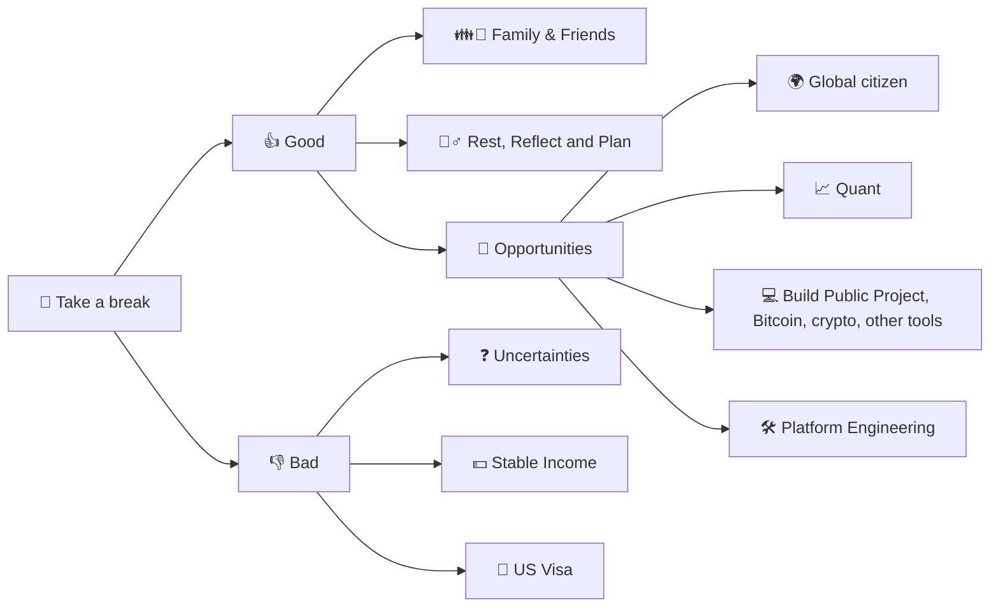

Take a break

```mermaid
flowchart LR
  A[🌴 Take a break]
  A --> B[👍 Good]
  A --> C[👎 Bad]
  B --> D["👪🤗 Family & Friends"]
  B --> E["🧘‍♂️ Rest, Reflect and Plan"]
  B --> F["🌟 Opportunities"]
  F --> G["🌍 Global citizen"]
  F --> H["📈 Quant"]
  F --> I["💻 Build Public Project, Bitcoin, crypto, other tools"]
  F --> J["🛠️ Platform Engineering"]
  C --> K[❓ Uncertainties]
  C --> L["💵 Stable Income"]
  C --> M["🛂 US Visa"]
```
